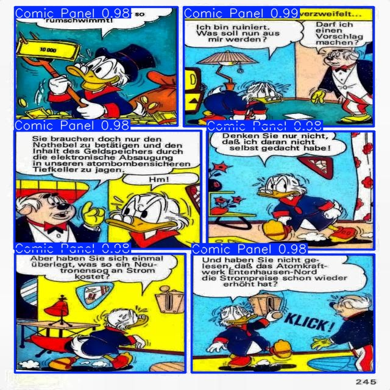
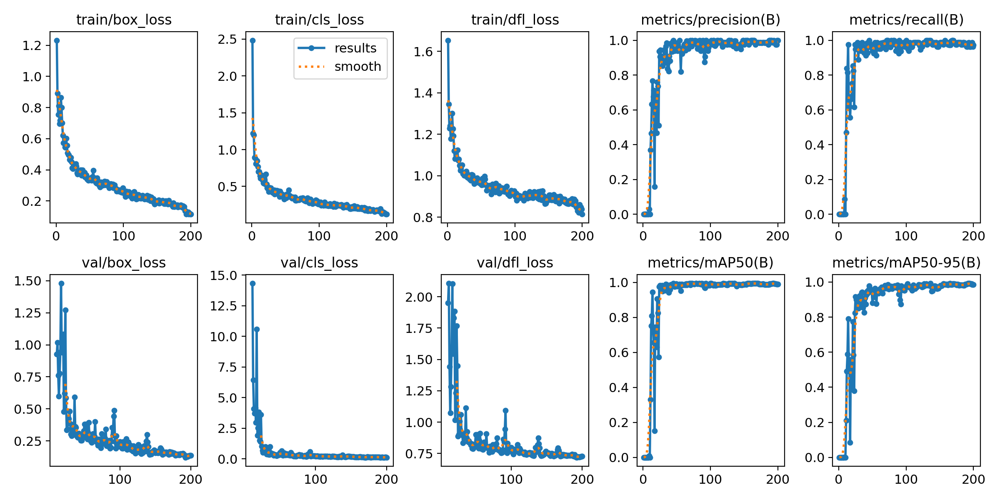
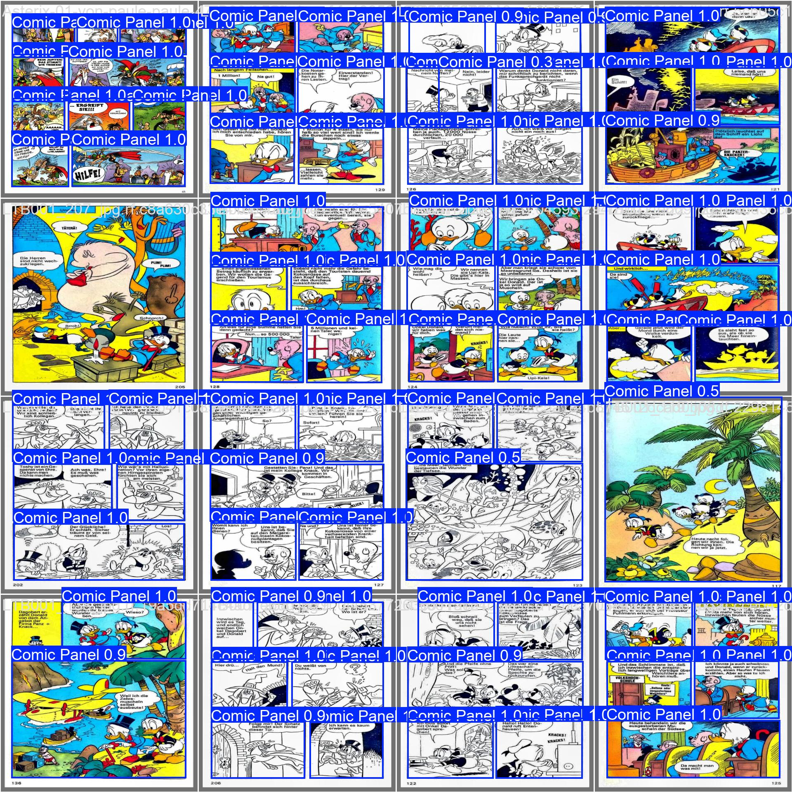

# YOLOv12 Comic Panel Detection

This repository contains a complete workflow for fine-tuning a **YOLOv12** model to detect panels in comic book pages. The project uses the powerful Ultralytics library and a custom dataset managed on Roboflow.

The primary goal is to demonstrate an end-to-end process: from setting up the environment and loading a pre-trained model to training, validating, and performing inference on new images.



## Key Features

*   **State-of-the-Art Model:** Fine-tunes the `yolo12x` model, the largest and most performant variant of the YOLOv12 series.
*   **Custom Dataset:** Integrates with Roboflow for easy dataset download, versioning, and management.
*   **End-to-End Workflow:** The entire process is detailed in a single Jupyter Notebook (`comic-boundary-detection.ipynb`).
*   **Comprehensive Evaluation:** Generates and displays key performance metrics, including loss curves, confusion matrices, and precision-recall curves.
*   **Reproducibility:** Aims for easy setup and execution, allowing others to replicate the results.

## File Structure

The repository is organized as follows:

```
.
├── comic-boundary-detection.ipynb  # The main notebook with all the code
├── my_yolo_train/                  # Directory for all training outputs
│   ├── demonstration/              # Output from the initial model test
│   ├── finetuning/                 # All artifacts from the fine-tuning process
│   │   ├── args.yaml               # Training configuration
│   │   ├── results.csv             # Training metrics per epoch
│   │   ├── results.png             # Plot of training/validation loss & metrics
│   │   ├── confusion_matrix.png    # Performance visualization
│   │   └── weights/
│   │       ├── best.pt             # Best performing model checkpoint (recommended for inference)
│   │       └── last.pt             # Model checkpoint from the final epoch
│   ├── prediction/                 # Inference output on a sample test image
│   └── validation/                 # Validation results on the test set
└── ...                             # Other project files
```

## Training Results

The model was trained for 200 epochs, achieving high performance on the validation set. Below are the key training metrics over time.



### Val Pred Visualization



## Model Checkpoints

The trained model weights are saved in the `my_yolo_train/finetuning/weights/` directory.

*   `best.pt`: The model checkpoint with the best mAP50-95 score on the validation set. **This is the recommended model for inference.**
*   `last.pt`: The model checkpoint saved at the end of the final training epoch.


## Acknowledgements

*   **Ultralytics** for the amazing [YOLOv12 model](https://github.com/ultralytics/ultralytics) and library.
*   **Roboflow:** for their dataset hosting platform and **custom-workflow-3-object-detection-g24r5-fmfkb** for compiling and annotating this incredible dataset.

## License

This project is licensed under the MIT License. See the `LICENSE` file for details. 